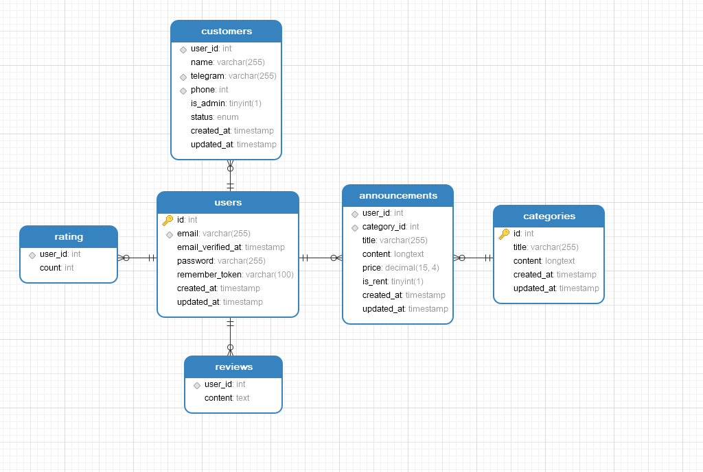

#Схема БД

В базе данных будет шесть таблиц:
1. announcements — таблица для хранения всех объявлений сервиса.
2. categories — таблица справочник для хранения категорий
3. customers — таблица для хранения информации о пользователе
4. rating — таблица для хранения рейтинга пользователя
5. reviews — таблица для хранения отзывов о пользователе
6. users — таблица для хранения всех пользователей системы

## Развертка каждой таблицы
### announcements
- `user_id` INT(10) NOT NULL,
- `category_id` INT(10) NOT NULL,
- `title` VARCHAR(255) NOT NULL COLLATE 'utf8_general_ci',
- `content` LONGTEXT NOT NULL COLLATE 'utf8_general_ci',
- `price` DECIMAL(15,4) NULL DEFAULT NULL,
- `is_rent` TINYINT(1) NOT NULL DEFAULT '0',
- `created_at` TIMESTAMP NULL DEFAULT NULL,
- `updated_at` TIMESTAMP NULL DEFAULT NULL,
- INDEX `FK_announcements_users` (`user_id`) USING BTREE,
- INDEX `FK_announcements_categories` (`category_id`) USING BTREE,
- CONSTRAINT `FK_announcements_categories` FOREIGN KEY (`category_id`) REFERENCES `rents_test`.`categories` (`id`) ON UPDATE NO ACTION ON DELETE CASCADE,
- CONSTRAINT `FK_announcements_users` FOREIGN KEY (`user_id`) REFERENCES `rents_test`.`users` (`id`) ON UPDATE NO ACTION ON DELETE CASCADE
### categories
- `id` INT(10) NOT NULL AUTO_INCREMENT,
- `title` VARCHAR(255) NOT NULL COLLATE 'utf8_general_ci',
- `content` LONGTEXT NOT NULL COLLATE 'utf8_general_ci',
- `created_at` TIMESTAMP NULL DEFAULT NULL,
- `updated_at` TIMESTAMP NULL DEFAULT NULL,
- PRIMARY KEY (`id`) USING BTREE
### customers
- `user_id` INT(10) NOT NULL,
- `name` VARCHAR(255) NULL DEFAULT '' COLLATE 'utf8_general_ci',
- `telegram` VARCHAR(255) NULL DEFAULT NULL COLLATE 'utf8_general_ci',
- `phone` INT(10) NULL DEFAULT NULL,
- `is_admin` TINYINT(1) NOT NULL DEFAULT '0',
- `status` ENUM('active','baned','delete') NOT NULL DEFAULT 'active' COLLATE 'utf8_general_ci',
- `created_at` TIMESTAMP NULL DEFAULT NULL,
- `updated_at` TIMESTAMP NULL DEFAULT NULL,
- UNIQUE INDEX `telegram` (`telegram`) USING BTREE,
- UNIQUE INDEX `phone` (`phone`) USING BTREE,
- INDEX `FK_customres_users` (`user_id`) USING BTREE,
- CONSTRAINT `FK_customres_users` FOREIGN KEY (`user_id`) REFERENCES `rents_test`.`users` (`id`) ON UPDATE NO ACTION ON DELETE CASCADE
### rating
- `user_id` INT(10) NOT NULL,
- `count` INT(10) NOT NULL,
- INDEX `FK__users` (`user_id`) USING BTREE,
- CONSTRAINT `FK__users` FOREIGN KEY (`user_id`) REFERENCES `rents_test`.`users` (`id`) ON UPDATE NO ACTION ON DELETE CASCADE
### reviews
- `user_id` INT(10) NOT NULL,
- `content` TEXT NOT NULL COLLATE 'utf8_general_ci',
- INDEX `FK__users_` (`user_id`) USING BTREE,
- CONSTRAINT `FK__users_` FOREIGN KEY (`user_id`) REFERENCES `rents_test`.`users` (`id`) ON UPDATE NO ACTION ON DELETE CASCADE
### users
- `id` INT(10) NOT NULL AUTO_INCREMENT,
- `email` VARCHAR(255) NOT NULL COLLATE 'utf8_general_ci',
- `email_verified_at` TIMESTAMP NULL DEFAULT NULL,
- `password` VARCHAR(255) NOT NULL COLLATE 'utf8_general_ci',
- `remember_token` VARCHAR(100) NULL DEFAULT NULL COLLATE 'utf8_general_ci',
- `created_at` TIMESTAMP NULL DEFAULT NULL,
- `updated_at` TIMESTAMP NULL DEFAULT NULL,
- PRIMARY KEY (`id`) USING BTREE,
- UNIQUE INDEX `email` (`email`) USING BTREE
## Графический вариант

